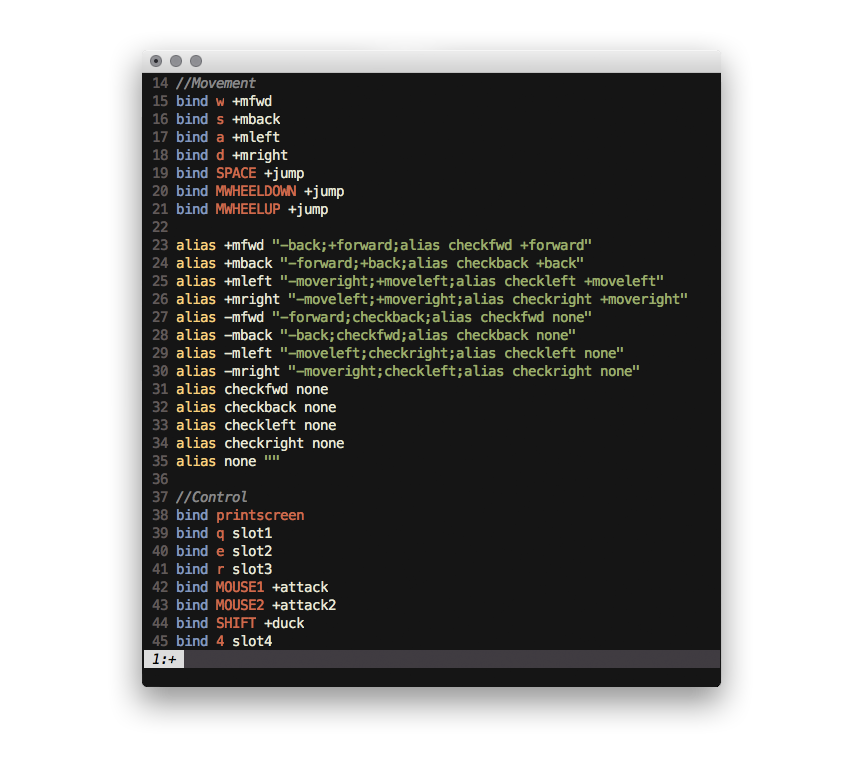

# vim-tf2
Dead simple vim syntax highlighting for TF2's configuration (.cfg) files.


*[Jellybeans](https://github.com/nanotech/jellybeans.vim) with Menlo:h12*

Installation
------------

If you don't have a preferred installation method, I recommend installing through [pathogen.vim](https://github.com/tpope/vim-pathogen):

#### OSX

```bash
git clone git@github.com:au/vim-tf2.git ~/.vim/bundle/vim-tf2
```

#### Windows

```batch
git clone git@github.com:au/vim-tf2.git %userprofile%/vimfiles/bundle/vim-tf2
```

#### Manual

1. [Download](https://github.com/au/vim-tf2/archive/master.zip) the repository.
2. Copy the syntax/cfg.vim file into your vim/syntax/ folder. Preferably, put it in your customization folder.
	- OSX: `~/.vim/syntax`
	- Windows `%userprofile%\vimfiles\syntax`

Enable Syntax!
---------------

Make sure you have `syntax enable` in your vimrc. Here's how:

#### OSX

Your `.vimrc` in your user root directory (`~`).

1. Open a Terminal and type `cd ~/.`
2. Open a folder there with `open .`
3. Edit the `.vimrc` file. 
	- If it isn't there, make one with `touch .vimrc`
4. Add a line: `syntax enable`

#### Windows

Your vimrc is called `_vimrc`, which is also in your user root.

1. Open a command prompt with Windows+R: `cmd`
2. Open the user root folder with `explorer %userprofile%`
3. Edit the `_vimrc` file.
	- If it isn't there, make one with `type NUL > _vimrc`
4. Add a line: `syntax enable`

If you're starting out with vim, I reccommend picking up Pathogen and [Sensible](https://github.com/tpope/vim-sensible) to help you on your vim journeys.

Credits
-------

Based from [Sumant Manne's](github.com/dpyro) original 2010 vim-tf2, which was based on the original quake.vim written by [Nikolai Weibull](github.com/now) in 2005.

License
-------

MIT. Basically, do what ya want, just keep the credits.
